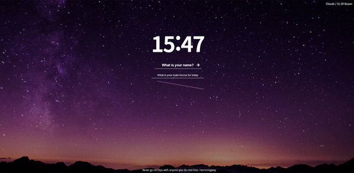

# MOMENTUM CLONE CODING

## 모멘텀

**HTML, CSS, Vanila JS, JSON, weather API**

**21.06.22 ~ 21.06.28**

https://0eun-momentum.netlify.app/

---

### 주요 구현 기능

- 실시간으로 현재 시간 표시
- 이름 새로고침시에도 브라우저에서 기억
- todo-list 작성, 삭제 가능 이름과 마찬가지로 새로고침 시 브라우저에서 기억
- 사용자의 현재 위치와 온도, 날씨 표시 (오른쪽 상단)
- 화면 하단에 랜덤 명언
- 랜덤으로 배경화면 표시

#### 메인화면 RESULT 

#### 기능구현 예시화면 RESULT (~38초)

 

---

이미지 출처 : [unsplash](https://unsplash.com/)

프로젝트 정보 : [노마드 코더](https://nomadcoders.co/)
